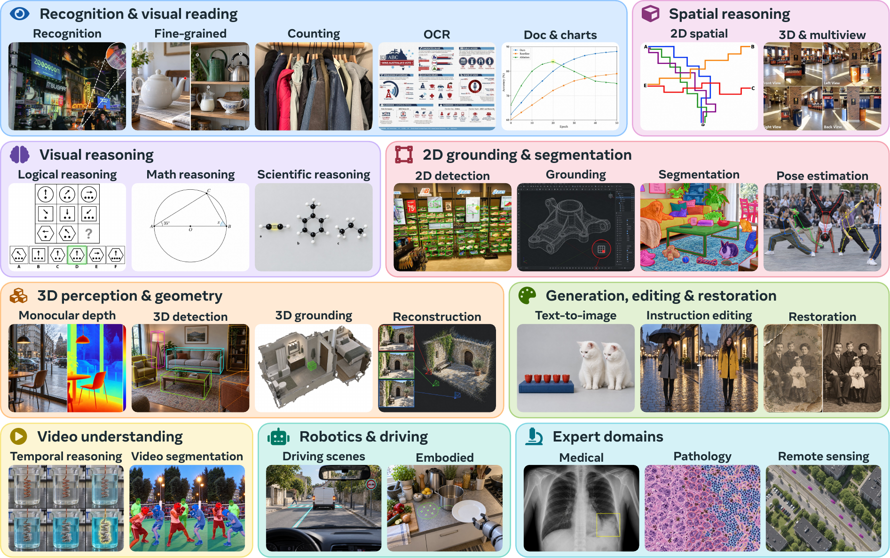

# Hard Vision, Easy Vision: What GPT-6 Astra Reveals Across Computer Vision

<p align="center">
  Hanoona Rasheed<sup>1,†</sup>, Mohammed Irfan Kurpath<sup>1,†</sup>, Bin Ren<sup>1</sup>, Hisham Cholakkal<sup>1</sup>, Fahad Shahbaz Khan<sup>1,2</sup>, Salman Khan<sup>1,2</sup>
</p>

<p align="center">
  <sup>1</sup>Mohamed bin Zayed University of Artificial Intelligence &nbsp;&nbsp; <sup>2</sup>Apertix
  <br>
  <sup>†</sup>Equal contribution
</p>

<p align="center">
  <a href="https://mbzuai-oryx.github.io/frontier-vision/"><b>Project Page</b></a> &nbsp;|&nbsp;
  <a href="https://mbzuai-oryx.github.io/frontier-vision/blog"><b>Blog</b></a>
</p>

<p align="center">
  
</p>

**Mapping the changing landscape of general-purpose vision.** Our study covers 34 capabilities across nine broad areas of computer vision, drawing on 55 benchmarks; representative tasks are illustrated here. We compare frontier systems with specialist models and human performance to examine how much of computer vision is now accessible through a general-purpose interface, where meaningful gaps remain, and where dedicated vision models are still necessary.

## Citation

If you find this work useful, please cite:

```bibtex
@article{rasheed2026frontiervision,
  title   = {Hard Vision, Easy Vision: What GPT-6 Astra Reveals Across Computer Vision},
  author  = {Rasheed, Hanoona and Kurpath, Mohammed Irfan and Ren, Bin and Cholakkal, Hisham and Khan, Fahad Shahbaz and Khan, Salman},
  journal = {arXiv preprint arXiv:XXXX.XXXXX},
  year    = {2026}
}
```
